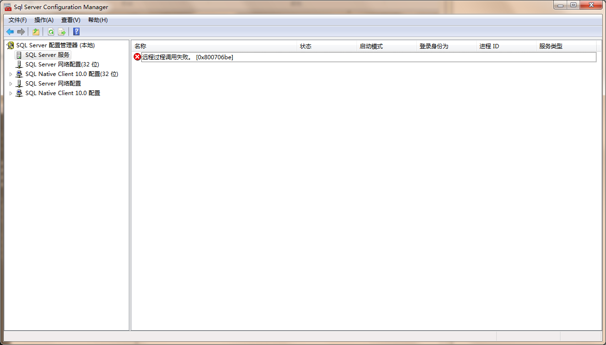
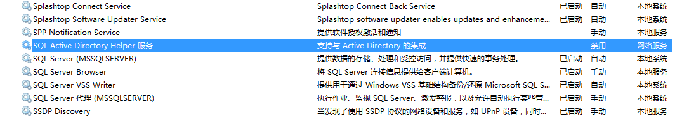
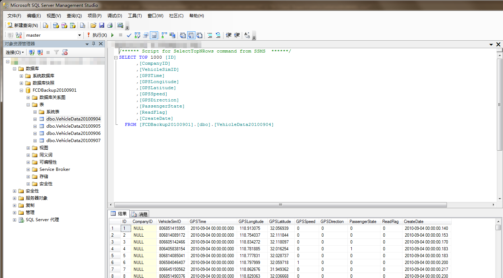

datasets are given in four exports of mdf ldf files
and three of them are compatible with SQL Server 2014
and only is not, so need to use 2008

despite  errs on RPC
(because it's on newer system win7, and it reports compatibility warning and I have installed SQL Server 2014)
just make sure  the services are running
you can connect using 

it's much simpler to use sqlcmd to export table
