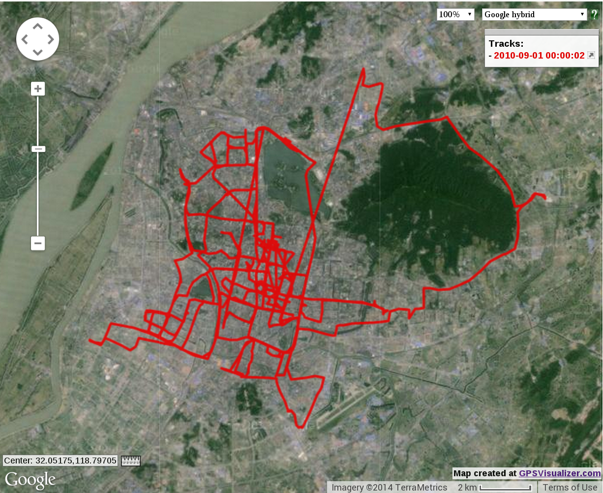
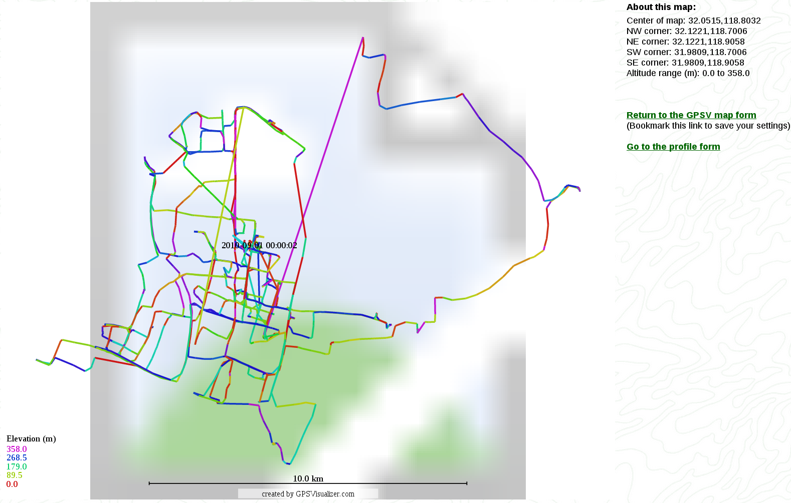

Processing
========
*   about the data
    *   the dataset consists of GPS samples from Taxi, during a 2 day period
*   From GPS sample points to Rides of a vehicle.
    *   Turns are calculated based on the direction data from the dataset, when the degrees of previous sample varies larger than TURNDEGREE (80), it's considered as a turn.
    *   Distance are calculated from the sample GPS points, using haversine formula.

Result and Comparison
========

* Track1
    *   INFO 11 turns, 7.89950758196 km
    *   
    *   
* Track2
    *   INFO 19 turns, 10.4048083663 km
    *   
    *   

*   The calculated turns is more than the visually identifiable turns.

How to
========

*   Visualize a vehicle data (entire 2 days track, or for single ride)
    *   using data in visualization.txt
    *   with [GPS Visualizer](http://www.gpsvisualizer.com/)
*   
    *   the outline align well with the road, block, water, mountain ...
    *   it looks good, but there can be a offset

*   
    *   Plot with direction colored, it's the degree of the vehicle's heading direction with a unknown base
    *   Sadly, the SVG can't render the background at the moment.
